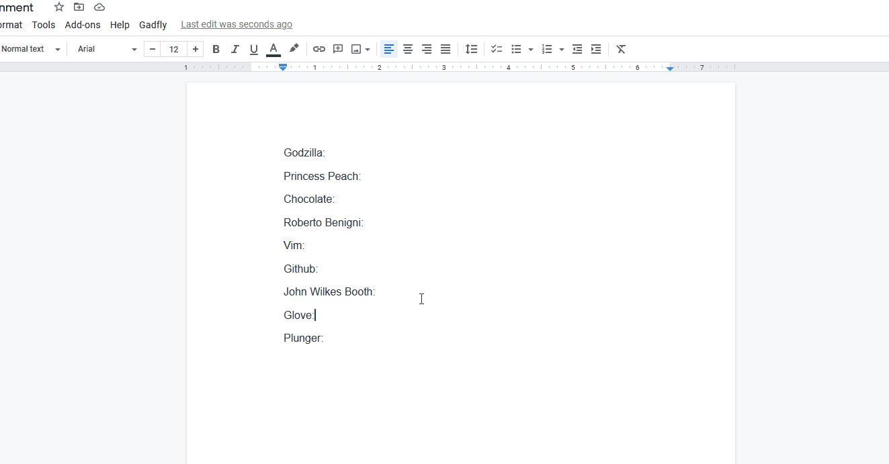

<h1 align="center">Gadfly </h1>

   

## 👠 Features

- Uses MediaWiki API with no external API wrapper
- Define all terms
- Easy interface
- Custom parser

## 🧱 Stack

- [Google Apps Script ](https://developers.google.com/apps-script)
- [TypeScript ](https://github.com/microsoft/TypeScript)
- [MediaWiki ](https://www.mediawiki.org/static/favicon/mediawiki.ico)
- [Clasp ](https://github.com/google/clasp)

## Changelog

If you have recently updated, please read the [changelog](/docs/CHANGELOG.md) for details of what has changed.

## 🧑‍🤝‍🧑 Contributing

Read the [contributing guide](/docs/CONTRIBUTING.md) to learn about our development process, and how to craft proposals.

## ⚖️ License

This project is licensed under the terms of the [MIT license](/docs/LICENSE).
